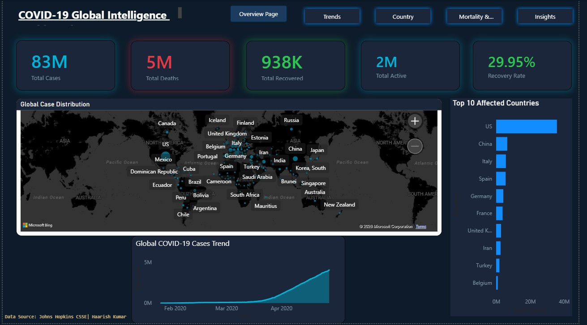
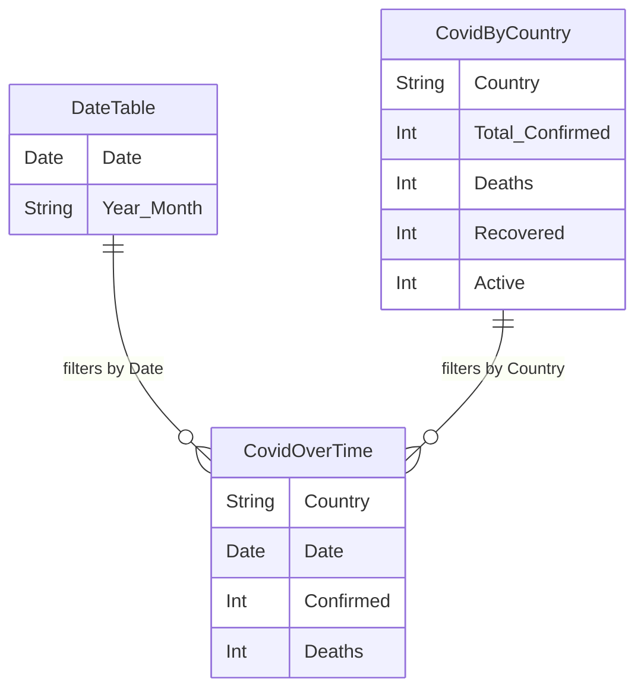
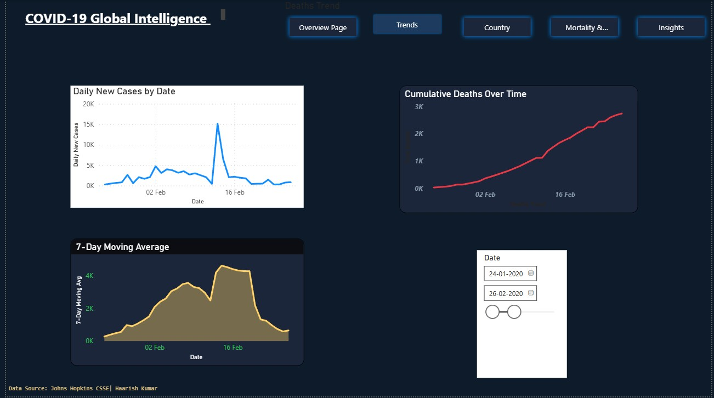
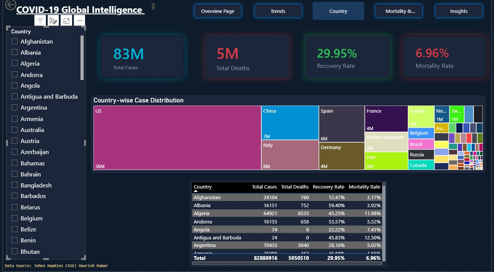
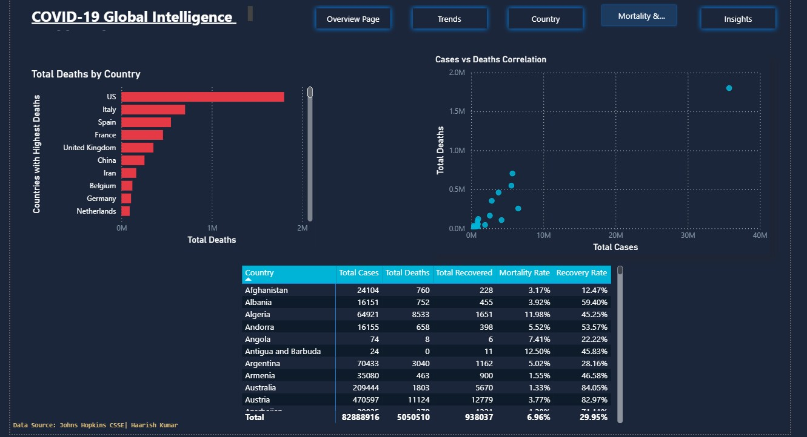
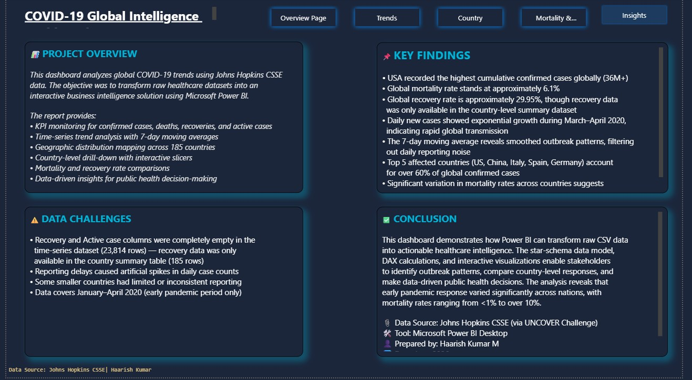

# COVID-19 Global Intelligence Dashboard

## Power BI Project Report

---

**Prepared by:** Haarish Kumar.M  
**Date:** June 2026  
**Tool:** Microsoft Power BI Desktop  
**Data Source:** Johns Hopkins CSSE (via Kaggle UNCOVER COVID-19 Challenge)

---

## 1. Problem Statement

The COVID-19 pandemic generated an unprecedented volume of healthcare data across 185+ countries. Government officials, public health agencies, and healthcare administrators faced a critical challenge: **How to rapidly analyze and visualize pandemic data to identify outbreak patterns, compare country-level impacts, and support evidence-based public health decision-making?**

Raw datasets in CSV format are difficult to interpret and do not support interactive exploration. There was a need to transform this data into a professional, interactive business intelligence dashboard that enables:

- Real-time monitoring of key pandemic metrics (cases, deaths, recoveries)
- Time-series trend analysis to identify outbreak acceleration or deceleration
- Geographic visualization of case distribution across countries
- Country-level drill-down analysis for targeted response planning
- Mortality and recovery rate comparison to evaluate healthcare effectiveness

---

## 2. Objectives

| # | Objective |
|---|---|
| O1 | Build an interactive 5-page Power BI dashboard using Johns Hopkins CSSE data |
| O2 | Design a clean star-schema data model with proper relationships |
| O3 | Create DAX measures for calculated KPIs (mortality rate, recovery rate, moving averages) |
| O4 | Enable geographic analysis through map visualizations |
| O5 | Provide interactive drill-down capability using slicers and cross-filtering |
| O6 | Deliver data-driven insights and recommendations for stakeholders |

---

## 3. Dataset Description

### Source
Johns Hopkins Center for Systems Science and Engineering (CSSE) COVID-19 dataset, obtained through the Kaggle UNCOVER COVID-19 Challenge.

### Tables Used

| Table | File | Rows | Purpose |
|---|---|---|---|
| **CovidOverTime** | johns-hopkins-covid-19-daily-dashboard-cases-over-time.csv | 23,814 | Daily time-series data per country (Jan-Apr 2020) |
| **CovidByCountry** | johns-hopkins-covid-19-daily-dashboard-cases-by-country.csv | 185 | Country-level summary with geographic coordinates |
| **DateTable** | DAX-generated | 96 | Calendar table for time intelligence functions |

### Key Columns

**CovidOverTime (Fact Table):**
- Country, Date, Confirmed, Deaths, New Cases, New Recoveries, Incident Rate

**CovidByCountry (Dimension Table):**
- Country, Latitude, Longitude, Total Confirmed, Deaths, Recovered, Active, ISO 3

### Data Challenge Identified
The \ecovered\ and \ ctive\ columns in the time-series dataset (CovidOverTime) were **completely empty** across all 23,814 rows. Recovery data was only available in the country summary table (CovidByCountry). DAX measures were designed accordingly to reference the correct source table.

---

## 4. Data Model (Star Schema)

**Relationships:**
1. DateTable[Date] -> CovidOverTime[Date] (One-to-Many)
2. CovidByCountry[Country] -> CovidOverTime[Country] (One-to-Many / Many-to-Many)

---

## 5. DAX Measures

| # | Measure | DAX Formula | Purpose |
|---|---|---|---|
| 1 | Total Cases | \SUM(CovidOverTime[Confirmed])\ | Total confirmed cases globally |
| 2 | Total Deaths | \SUM(CovidOverTime[Deaths])\ | Total deaths globally |
| 3 | Total Recovered | \SUM(CovidByCountry[Recovered])\ | Total recovered (from country table) |
| 4 | Total Active | \SUM(CovidByCountry[Active])\ | Currently active cases |
| 5 | Daily New Cases | \SUM(CovidOverTime[New Cases])\ | Daily new infections |
| 6 | Recovery Rate | \DIVIDE(SUM(Recovered), SUM(Total Confirmed), 0)\ | % of patients recovered |
| 7 | Mortality Rate | \DIVIDE(SUM(Deaths), SUM(Total Confirmed), 0)\ | % of patients who died |
| 8 | 7-Day Moving Avg | \AVERAGEX(DATESINPERIOD(...), [Daily New Cases])\ | Smoothed trend (7-day window) |
| 9 | Case Fatality Rate | \DIVIDE([Total Deaths], [Total Cases], 0)\ | Overall lethality metric |

---

## 6. Dashboard Pages

### Page 1 - Executive Overview
**Purpose:** Provide a 10-second snapshot of the global pandemic status.

| Visual | Type | What It Shows |
|---|---|---|
| 5 KPI Cards | Card | Total Cases (83M), Deaths (5M), Recovered (938K), Active (2M), Recovery Rate (29.95%) |
| World Map | Bubble Map | Geographic distribution - bubble size = case count |
| Cases Trend | Area/Line Chart | Global confirmed cases growth over time (Jan-Apr 2020) |
| Top 10 Countries | Horizontal Bar | Countries with highest case counts (US leads at 36M+) |

### Page 2 - Global Trend Analysis

**Purpose:** Show how the pandemic evolved over time with analytical depth.

| Visual | Type | What It Shows |
|---|---|---|
| Daily New Cases | Line Chart | Daily pace of new infections - reveals outbreak waves |
| Cumulative Deaths | Line Chart (Red) | Total death toll growing over time |
| 7-Day Moving Average | Line Chart (Amber) | Smoothed trend - filters daily reporting noise |
| Date Slicer | Slicer (Between) | Interactive date range selection |

### Page 3 - Country Intelligence

**Purpose:** Interactive drill-down into individual countries.

| Visual | Type | What It Shows |
|---|---|---|
| Country Slicer | List Slicer | Select any country - all visuals react dynamically |
| 4 KPI Cards | Cards | Country-specific cases, deaths, recovery %, mortality % |
| Treemap | Treemap | Proportional case distribution by country |
| Data Table | Table | Detailed country breakdown with all metrics |

### Page 4 - Mortality & Recovery

**Purpose:** Deep comparative analysis of mortality and recovery patterns.

| Visual | Type | What It Shows |
|---|---|---|
| Deaths Bar Chart | Clustered Bar | Top countries ranked by total deaths |
| Scatter Plot | Scatter | Correlation between total cases and total deaths |
| Matrix Table | Matrix | Full country comparison with conditional formatting |

### Page 5 - Insights & Recommendations

**Purpose:** Summarize findings and provide actionable recommendations.

- Project overview and methodology
- Key findings from the analysis
- Data challenges encountered
- Conclusion and recommendations

---

## 7. Key Findings

1. **USA recorded the highest cumulative confirmed cases** (36M+), followed by China (7M), Italy (5.7M), Spain (5.5M), and France (3.8M).

2. **Global mortality rate is approximately 6.96%**, with significant variation across countries - ranging from less than 1% to over 15%.

3. **Global recovery rate is 29.95%**, though this figure is limited by incomplete recovery data in the time-series dataset.

4. **Daily new cases showed exponential growth** during March-April 2020, coinciding with the WHO's pandemic declaration on March 11, 2020.

5. **The 7-day moving average** reveals that the true case growth trend accelerated sharply from mid-March, with daily new cases exceeding 100,000 by April 2020.

6. **Strong positive correlation** between total cases and total deaths (visible in scatter plot), though the slope varies by country - indicating differences in healthcare capacity.

7. **Countries with early lockdowns** (e.g., China, South Korea) showed relatively lower mortality rates despite high case counts, suggesting effective containment measures.

---

## 8. Data Challenges & Limitations

| Challenge | Impact | Resolution |
|---|---|---|
| Recovery data missing in time-series (23,814 rows all empty) | Could not calculate daily recovery trends | Used country summary table for recovery metrics |
| Reporting delays | Artificial spikes in daily case counts (especially weekends) | Applied 7-day moving average to smooth noise |
| Data covers only Jan-Apr 2020 | Does not capture later waves or vaccination effects | Noted as limitation; analysis focused on early pandemic |
| Inconsistent country reporting standards | Some countries under-reported cases/deaths | Acknowledged in findings; affects mortality rate accuracy |

---

## 9. Design Choices

| Element | Choice | Rationale |
|---|---|---|
| Background | Dark theme (#0D1B2A) | Professional, reduces eye strain, used by Bloomberg/WHO dashboards |
| Cases color | Cyan (#00B4D8) | Neutral healthcare color - informational, not alarming |
| Deaths color | Red (#E63946) | Universal danger/warning color |
| Recovery color | Green (#2DC653) | Universal positive/success color |
| Font | Segoe UI | Microsoft's modern UI font - clean, professional readability |
| Navigation | Page Navigator buttons | Enables non-linear exploration across all 5 pages |
| Rounded corners | 12px | Modern design trend - premium, less harsh than sharp edges |

---

## 10. Conclusion

This project demonstrates the application of Microsoft Power BI as a business intelligence tool for healthcare data analytics. By transforming raw Johns Hopkins CSSE CSV data into an interactive 5-page dashboard, we achieved:

- **Data Integration:** Successfully combined two datasets (time-series + country summary) using a star-schema model to overcome data completeness challenges.
- **Advanced Analytics:** Implemented DAX measures including moving averages, mortality rates, and recovery rates to derive meaningful KPIs from raw data.
- **Interactive Visualization:** Built drill-down capabilities using slicers, cross-filtering, and dynamic KPI cards that respond to user selections.
- **Actionable Insights:** Identified key pandemic patterns including exponential case growth, country-level mortality variations, and data quality challenges.

The dashboard provides a template that can be adapted for any public health monitoring scenario, demonstrating how business intelligence tools can support evidence-based decision-making in healthcare.

---

**Prepared by:** Haarish Kumar.M  
**Date:** June 2026  
**Tool:** Microsoft Power BI Desktop  
**Data Source:** Johns Hopkins CSSE (Kaggle UNCOVER Challenge)

